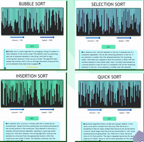

# _*ALGO WEB*_ 

## VISUALISE BASIC SORTING ALGORITHMS

`WEBSITE LINKS` : [Click Here](https://github.io/ "Algorithm App")

### Website Preview

### Currently Available Sorting Techniques :

- Bubble Sort
- Selection Sort
- Insertion Sort
- Quick Sort

### Available Coding Language Snippets:

| C   | C++ | Java | Python |
| --- | --- | ---- | ------ |

---

# FEATURES

- Mutiple Sorting Visualization at once
- Dynamically the element get changed
- Responsive across a wider range of device
- Smooth Scrolling
- Attractive UI
- Single Page Application
- Visualization with attractive colors and effects
- Can understand the basics of Sorting through Definition
- Know the time and space complexity through pictorial representation
- Access the code snippet for various sorting in 4 different programming language (_*SOURCE*_ : GeeksforGeek and Tutorialspoint)
- Provide source to learn better and master this sorting Techniques (_*SOURCE*_ : GeeksforGeek)

# ISSUE

- Speed Slider not working in Bubble, Insertion and Selection Sort
- Visualization don't stop once started
- Requires _AUTOMATIC REFRESH_ after Quick Sort

# PROJECT INFERENCE

1. Learned the important functions of `JQuery` and it's implementation to make the Website more functional and dynamic
2. Learned how to use the classes of `Bootstrap` to make the code responsive. The concept and the use of grid system became more crystal clear
3. The most important part is that, the use of delay function e.g setTimeout() helped me a lot to render the vizualization
4. I rely on HTML Structure `div` and Jquery for the animations and it worked well without `CANVAS`
5. Learned how to scrape the content inside the HTML Structure using Jquery inorder to get copied in the clipboard

# FUTURE IMPLEMENTATION

1. Merge the entire `.js` script into a single file
2. Addding Merge and Heap Sort
3. Keeping one screen for vizualization with multiple sorting options
